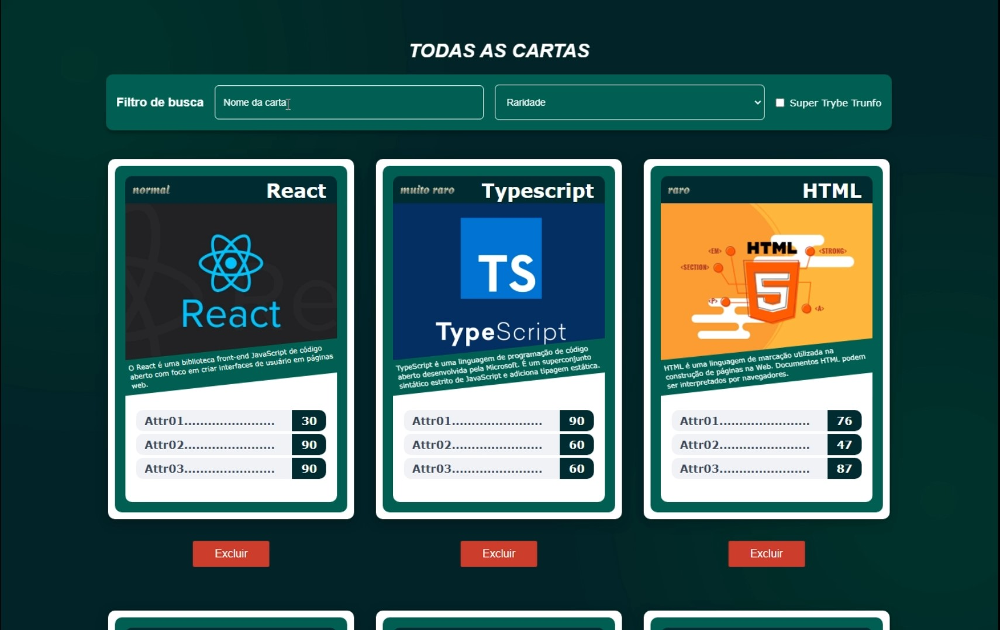

# Tryunfo

O Tryunfo é uma aplicação desenvolvida com React e React Router que permite aos usuários cadastrar cartas para jogar o famoso jogo de cartas "Trunfo". Neste jogo, cada carta representa um personagem, objeto ou conceito e possui diferentes atributos com valores numéricos que os tornam únicos e interessantes para o jogo.



## Requisitos

- Node.js versão 16 ou 18.

## Instalação

Para executar o projeto localmente, siga as etapas abaixo:

1. Certifique-se de ter o Node.js instalado em sua máquina. Você pode baixar a versão adequada em https://nodejs.org/.

2. Faça o clone deste repositório para o seu computador usando o seguinte comando:

```bash
git clone git@github.com:albertoflorence/tryunfo.git
```

3. Acesse a pasta do projeto:

```bash
cd tryunfo
```

4. Instale as dependências necessárias utilizando o npm:

```bash
npm install
```

## Executando o Projeto

Após instalar as dependências, você pode iniciar o projeto localmente com o seguinte comando:

```bash
npm start
```

Isso iniciará o servidor de desenvolvimento e abrirá o projeto no seu navegador padrão. Agora, você poderá acessar o jogo em http://localhost:3000.

## Testes

Para executar os testes do projeto, utilize o seguinte comando:

```bash
npm test
```

Isso iniciará a execução dos testes e fornecerá os resultados no terminal.

Sinta-se à vontade para explorar e modificar o código conforme suas necessidades.
